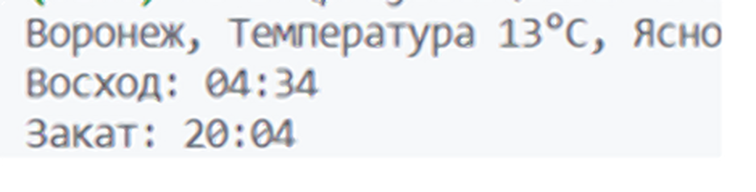

# Приложение для получения текущей погоды

Сперва получите свой API-ключ на сайте [OpenWeather](https://openweathermap.org/)
и добавьте его в файл *constants.py*

## Запуск приложения:

Клонируем репозиторий:
```bash
git clone https://github.com/tooyoungforthis/current_weather
```

Откроем папку с репозиторием
```bash
cd current_weather
```

Создадим виртуальное окружение
```bash
python -m venv venv
```

Активируем виртуальное окружение
```bash
.\venv\Scripts\activate
```

Установим необходимые зависимости
```bash
pip install -r requirements.txt
```

Запустим приложение
```bash
python weather.py
```

## Полученный результат:


## License
MIT